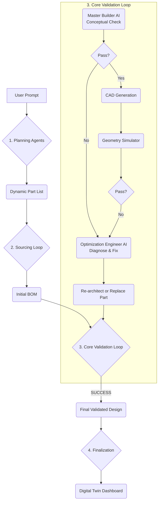

Feasibility Matrix: The Roadmap from 7/10 to 9.5/10
Feature	Feasibility (Now)	Required Tech / Tools	Primary Challenge	Verdict
1. Constraint Solving	10/10	python-constraint library	Data Extraction: Reliably getting the numbers (e.g., mounting_mm) from the BOM to feed into the solver. The solver itself is simple.	Yes, Immediately. This is a pure software task and a huge reliability win.
2. Curated Database	10/10	SQLite, PostgreSQL	Human Labor: Manually populating and verifying 500+ components is a massive, expert-driven data entry task.	Yes, Immediately. The bottleneck is human effort, not technology.
3. Empirical Correction	9/10	numpy, scikit-learn	Data Pipeline: Building the infrastructure to collect, clean, and process user-submitted flight logs. The math is straightforward.	Yes. The basic correction factors are easy. The full RL loop is a larger data engineering project.
4. Firmware Matrix	8/10	Python Dictionaries, JSON Schema	Knowledge Codification: An expert must manually translate "tribal knowledge" into a machine-readable format. It's brittle and needs constant maintenance.	Yes, but it requires expert input. It's a manual knowledge-base creation task.
5. Thermal/Vibration	7/10	numpy, scipy	Model Derivation: The code is easy, but the simplified physics formulas must be derived from academic papers or real-world experiments. You can't just guess them.	Yes, if you have the physics expertise. The challenge is in the physics modeling, not the programming.
6. Human Escalation	10/10	Slack API, Zendesk API, Email Lib	Operational: Who is the expert on the other end? How is their feedback ingested back into the system? It's a workflow design problem.	Yes, trivially. The technology for creating and routing tickets is very mature.
7. Regulatory/Safety	9/10	Python Dictionaries, JSON	Legal Maintenance: Drone laws change constantly and vary by region. Keeping the rule set up-to-date is a non-trivial legal/administrative task.	Yes. A basic version for a single region (e.g., the >250g FAA rule) is very easy to implement.
8. Continuous Learning	7/10	Database, ML Framework, Job Scheduler	MLOps Infrastructure: This is a full MLOps project requiring a data pipeline, retraining scripts, and model deployment strategies.	Yes, but it's a significant project. The tools all exist, but this is a complex system to build.

# OpenForge: The Autonomous Drone Architect

<div align="center">

[](https://www.python.org/)
[](https://www.gnu.org/licenses/agpl-3.0)
[]()

An AI-powered generative engineering system that designs, validates, and documents custom FPV drones from natural language requirements.

</div>

---

**OpenForge is an AI-powered Hardware Compiler.** It transforms high-level, natural language requests into fully engineered, flight-ready drone designs.

Unlike standard chatbots that often hallucinate hardware specifications, OpenForge utilizes a **Cyber-Physical Agentic Workflow**. It interviews the user, browses the real-time internet for available components, reads technical diagrams using Computer Vision, validates the design for conceptual and geometric compatibility, generates manufacturing files (CAD), and renders an interactive 3D Digital Twin.

Most importantly, OpenForge is **resilient**. When it encounters design flaws or sourcing failures, it autonomously diagnoses the problem and enters a self-correction loop to find a viable solution.


## 🚀 Features

#### 1. Dynamic, Multi-Agent Engineering Core
*   **The Architect:** Analyzes user intent to dynamically determine all required component categories (e.g., adds a `Companion_Computer` for autonomy, a `GPS_Module` for long range, etc.), moving beyond static templates.
*   **The Sourcing Engineer:** Generates specific, context-aware search queries for the dynamically generated parts list.
*   **The Master Builder:** Acts as a quality control expert, analyzing the sourced parts for conceptual compatibility before any CAD is generated.
*   **The Optimization Engineer:** Diagnoses design failures (`conceptual`, `geometric`, or `sourcing`) and formulates a precise recovery strategy.

#### 2. Autonomous Validation & Self-Correction
*   **Agentic Loop:** The system is not a linear pipeline but a resilient loop. It iterates on a design until all validation checks pass.
*   **"Nuke and Rebuild" Strategy:** For fundamentally flawed designs (e.g., a mix of industrial and hobby-grade parts), the AI intelligently scraps the entire Bill of Materials and re-architects the build around a new, known-good "anchor" component.

#### 3. Fusion Sourcing Engine
*   **Real-Time Search:** Scrapes the web for currently available components and prices, avoiding outdated or out-of-stock parts.
*   **Generative Vision AI:** Uses a "Vision Prompt Engineer" (a meta-AI) to dynamically generate analysis prompts for any component type. This allows the system to extract critical specs like mounting patterns and dimensions from product images, even for parts it has never seen before.

#### 4. Physics, Fabrication, and Digital Twin
*   **Physics Simulation:** Calculates Thrust-to-Weight Ratio (TWR), Disk Loading, and estimated flight time based on the validated Bill of Materials.
*   **Generative CAD:** Procedurally generates OpenSCAD scripts and STL files based on the specific dimensions of the sourced parts.
*   **Interactive Dashboard:** The final output is a WebGL (Three.js) Digital Twin featuring an animated, step-by-step assembly guide, a complete Bill of Materials with links, and flight telemetry charts.

## 🛠️ Architecture

OpenForge operates not as a simple pipeline, but as a resilient, multi-agent system with a core validation loop.

<div align="center">


</div>

## 📦 Installation

#### Prerequisites
*   **Python 3.10+**
*   **OpenSCAD:** The command-line tool must be installed and in your system's PATH.
    *   **Linux:** `sudo apt install openscad`
    *   **Mac:** `brew install --cask openscad`
    *   **Windows:** Download installer from [openscad.org](https://openscad.org/downloads.html)
*   **Google AI API Key**

#### Setup
1.  **Clone the repository:**
    ```sh
    git clone https://github.com/your-username/openforge.git
    cd openforge
    ```

2.  **Create and activate a virtual environment:**
    ```sh
    python3 -m venv venv
    source venv/bin/activate  # On Windows use: venv\Scripts\activate
    ```

3.  **Install dependencies:**
    ```sh
    pip install -r requirements.txt
    playwright install  # Installs browsers for the web scraper
    ```

4.  **Configure Environment:**
    *   Create a `.env` file in the root directory.
    *   Add your Google AI API key:
    ```.env
    GOOGLE_API_KEY="your_gemini_api_key_here"
    GOOGLE_SEARCH_ENGINE_ID="your_cse_id_here" # Required for component search
    ```

## 🖥️ Usage

Run the main entry point and follow the interactive prompts.

```sh
python3 main.py
```

1.  **Intake:** Enter your high-level mission requirements (e.g., "A rugged 5-inch freestyle drone for under $400").
2.  **Interview:** The AI will ask clarifying questions if needed.
3.  **Processing:** Watch the console as the agents design, source, validate, and self-correct the build.
4.  **Result:** A browser window will automatically open displaying the final, validated Digital Twin.

All generated artifacts are saved to the `output/` directory, including the `dashboard.html`, all `*.stl` files, and the `master_record.json` audit trail.

## 📂 Project Structure

```
/
├── app/
│   ├── services/
│   │   ├── ai_service.py       # Core AI agent functions (Architect, Engineer, etc.)
│   │   ├── fusion_service.py   # Orchestrates Search, Scrape & Vision
│   │   ├── cad_service.py      # OpenSCAD Generation
│   │   └── ...                 # Other microservices
│   └── prompts.py              # System instructions for all AI agents
├── cad/
│   └── library.scad            # Parametric SCAD library for drone parts
├── templates/
│   └── dashboard.html          # WebGL Digital Twin Template
├── output/                     # Generated artifacts (STLs, dashboard, logs)
└── main.py                     # Main application entry point and orchestrator
```

## ⚠️ Disclaimer

OpenForge is an advanced prototype demonstrating the potential of generative AI in engineering.
*   **Safety:** Always double-check component compatibility and prices before purchasing.
*   **Simulations:** Physics and cost estimations are based on scraped data and are approximations.
*   **Sourcing:** The web is constantly changing. The scraping and data extraction services may require maintenance as websites evolve.

## 🤝 Contributing

Contributions are welcome! Please focus on areas that enhance the system's intelligence and robustness:
*   **AI Agent Prompts:** Improving the instructions and reasoning capabilities in `app/prompts.py`.
*   **Scraper Resilience:** Adding more robust data extraction patterns for a wider variety of e-commerce sites.
*   **CAD Library:** Expanding the `cad/library.scad` with more parametric component models.
*   **Physics Models:** Improving the accuracy of the drag and thrust calculations in `physics_service.py`.

## 📄 License

This project is licensed under the AGPL v3. See the `LICENSE` file for details. This software is open source, but if you modify it and provide it as a service over a network, you must also share your modified source code.
```
